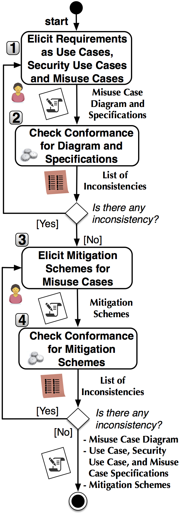

## Overview 

RMCM-Verifier (Restricted Misuse Case Modeling Verifier) is a tool for checking the consistency between the misuse case diagram and the specifications, and between the specifications and the RMCM template. RMCM-Verifier automatically checks consistency and reports inconsistencies such as a misuse case diagram missing a threaten or mitigate relationship in specifications.

The key features of RMCM-Verifier are:

* Check RMCM syntax: this feature loads all use cases, security use cases and misuse cases specifications from IBM DOORS to Gate, and applies Natural Language Processing (NLP) to check if the specifications are consistent with RMCM template. If there is/are syntax error(s) in the specifications, this tool will report all in the unknown.html file. All errors (if available) will be explained in detail and give exactly id in IBM DOORS to help user easily check them.

* Check RMCM syntax (Debug): this feature loads Gate Developer with our RMCM Application and all specifications from IBM DOORS. Then, user can run himself our RMCM Application. This way helps user understand how our application runs, and view all annotations after processing.

* Check Misuse Case Diagram - Specification Consistency: the consistency between Misuse Case diagram and specifications will be reported thanks to this feature. In detail, this third feature (1) loads misuse case diagram (from *.uml file, which is defined in Papyrus) and use cases, security use cases, misuse cases specifications (from IBM DOORS); then (2) compares name and types of use cases, security use cases, misuse cases from diagram with ones in specifications; checks association actor-use case, relationships (include, threaten, mitigate) between use cases, security use cases and misuse cases; (3) reports all inconsistencies (if available) in MisuseCaseAnalysis.html file.

RMCM-Verifier has been successfully evaluated on an industrial case study.

## Workflow

The process in the figure below describes our approach which is composed of 4 steps. 

* Step 1, "Elicit requirements as use cases, security use cases and misuse cases": the analyst elicits functional and security requirements relying on a misuse case diagram and the RMCM template.

* Step 2, "Check conformance for diagram and specifications": our tool RMCM-Verifier automatically checks the consistency between the misuse case diagram and specifications, and between the specifications and the RMCM template. If there is any inconsistency, the analyst updates the diagram or specifications (Step 1).

* Step 3, "Elicit mitigation schemes for misuse cases": mitigation schemes are elicited for the security threats specified in misuse cases.

* Step 4, "Check conformance for mitigation schemes": RMCM-Verifier automatically checks whether the mitigation schemes conform to the mitigation template.

## Download, Installation and sample artifacts

To install and run RMCM-Verifier please:

1. Download the installation package and sample artifacts: [RMCM_Distro](https://dropit.uni.lu/invitations?share=e07585bb2a55e568bcaf&dl=0)

2. Follow user manual: [RMCM_Verifier_UserManual](https://dropit.uni.lu/invitations?share=f813821ffd59bb2ca66b&dl=0)

3. Results after checking conformance between Misuse Case Specifications with RMCM Template and between Misuse Case Specifications with Misuse Case Diagram:
..1. Inconsistencies between Misuse Case Specifications with RMCM Template are stored in [unknownstep.html](https://dropit.uni.lu/invitations?share=d50c349fb1265a49ab19&dl=0) file. (This file is located at C:/EDLAH2/RMCM/result/)
..2. Inconsistencies between Misuse Case Specifications with Misuse Case Diagram are stored in [MisuseCaseAnalysis.html](https://dropit.uni.lu/invitations?share=bfd15a52e9f72f59752e&dl=0) file. (This file is at C:/EDLAH2/RMCM/result/misusecases/)

